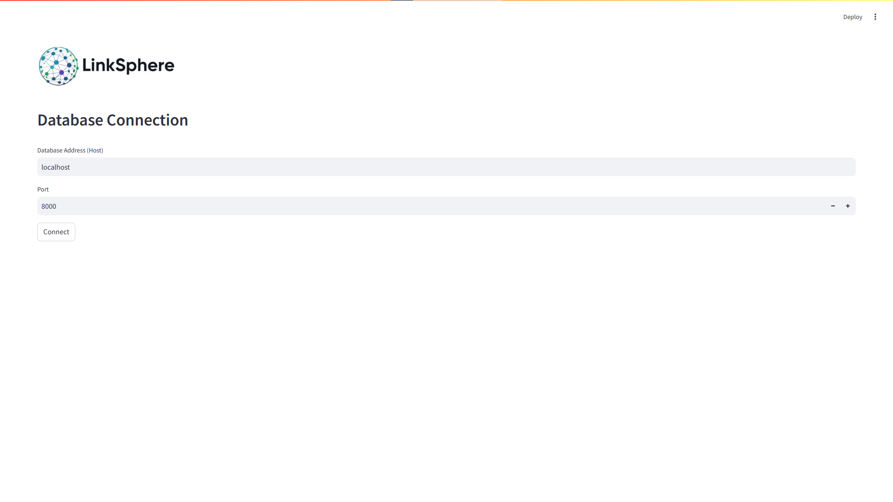
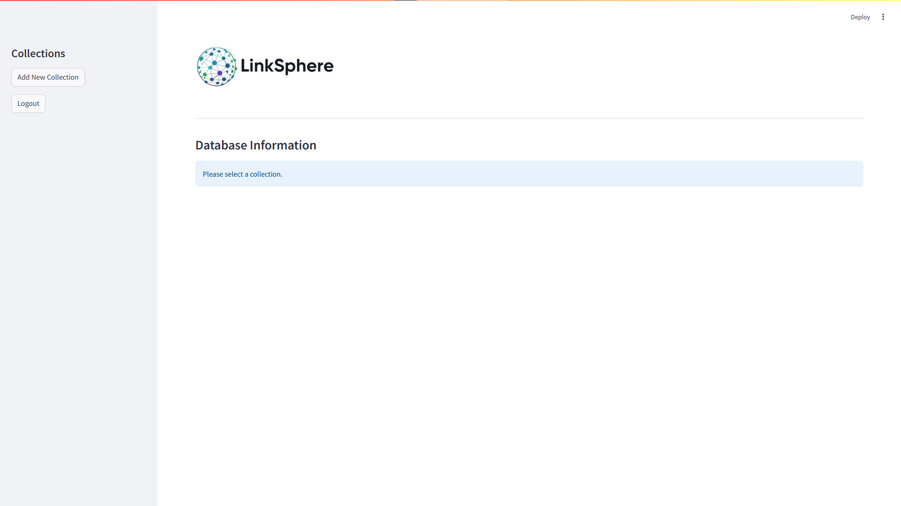
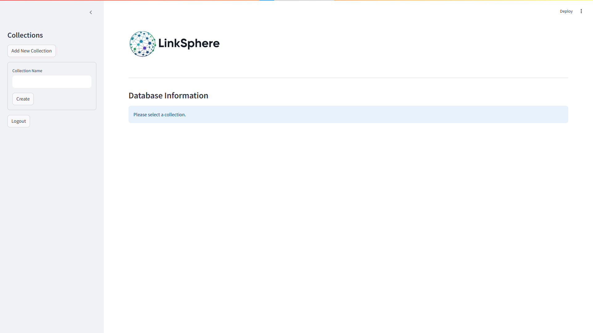
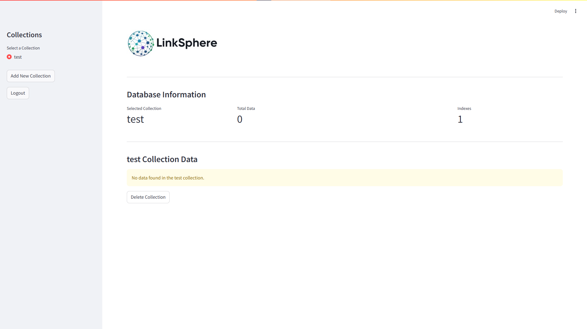
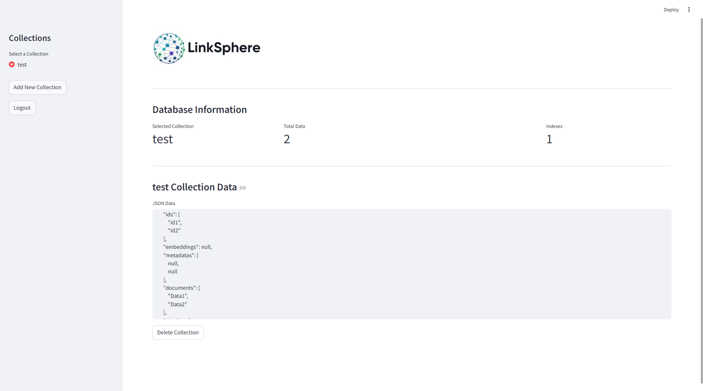

# LinkSphere

**LinkSphere** is a user-friendly interface built for interacting with **ChromaDB**. Users can connect to the database, manage collections, and view data effortlessly. With a clean and simple design, LinkSphere helps you organize and explore your data.

This project is still under development and new features are being added and improved continuously. Whether you're just starting or an experienced user, LinkSphere makes managing your collections simple and efficient.

---

## Features

- **ChromaDB Connection**: Connect to your ChromaDB instance by entering the address.
- **Collection Management**: Easily add and delete collections.
- **View Collection Data**: Select a collection to directly access and view its data.
- **Data Visualization**: Built-in support for visualizing data in a simple and clean interface.

---

## Preview

Here is a quick preview of the **LinkSphere** interface:











---

## Installation

To get started with **LinkSphere**, follow these simple steps:

1. **Clone the repository:**
   
   ```bash
   git clone https://github.com/yourusername/LinkSphere.git

2. Navigate to the project directory:

   cd LinkSphere

3. Install the required dependencies:

   pip install -r requirements.txt

4. Run the application:

   streamlit run LinkSphere.py

Help

This project is still being developed. If you'd like to contribute or have suggestions, feel free to reach out!

"Don't Panic!" – The Hitchhiker’s Guide to the Galaxy